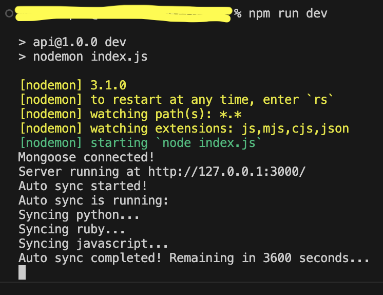

## App Description &#128196;

### <span style="text-align: center;">This is a service, that is able to check GitHub API and pull trending repositories.</span>

<br>

1. What is defined under trending repositories?

    >First &#128175; repositories with the highest amount of &#10032;&#10032;&#10032;.

2. What kind of repositories are used to be pulled?

    >Any kind of repositories with only one exeption: **Language of repository should be: [JavaScript, Ruby, Python].**

3. What is the recovery time of auto synchronization?

    >**By default**, recovery time of auto synchronization with GitAPI is **1 hour**. You also can change it for your own purpose in file: ./.env (param: AUTO_SYNC_TIME).

4. Repositories based on what of the three languages (mentioned above) the auto synchronization does itself?

    >Auto synchronization consecutively pulled perositories in sequence: [python > ruby > javascript].

5. Is it possible to choose, which of three repository to pull manually?

    >Yes, one of three repositories, which is mentioned above. <br>*Request should contain body data, as in example:<br> ```
    { "language": "python" }```*.

6. Is it possible to stop/start auto synchronization?

    >Yes.

## Launch instructions &#128196;

Technologies used:

- **Backend**:
  - NodeJS (ExpressJS);
  - MongoDB (mongoose) - cause we have not any relationships in database;
  - Insomnia (for API test);
  - NGINX <span style="font-size: smaller">(in progress...);</span>
  - Docker + Compose <span style="font-size: smaller">(in progress...);</span>
- **Frontend**:
  - Vue3 <span style="font-size: smaller">(in progress...);</span>
  - Bootstrap5 <span style="font-size: smaller">(in progress...);</span>
  - Webpack <span style="font-size: smaller">(in progress...);</span>
  - CSS/SCSS/HTML <span style="font-size: smaller">(in progress...);</span>

---

1. Clone repository/archive to your **local folder**;
2. Open Terminal and make sure You are in **local folder**:

```
cd '.../local_folder'
```

3. Copy file dev.env and rename to .env in the same root directory:

```
cp dev.env .env
```

4. *(optional)* Open and follow the instructions in the new created .env file if you want *to specify app-host and outer-port for docker containers* <span style="font-size: smaller">(in progress...);</span>

5. Go to the API folder and install all necessary modules:

```
cd '.../local_folder/API' && npm install
```

6. For this step You should already have installed MongoDB locally on your PC. Make sure, that MongoDB Client is running.

7. Now You can start the server(api) locally.<br>This will start the server, connect to mongoDB and create database named: *github_trending*

```
npm run dev
```

8. In the Terminal You can see:

<span align="center">
  
</span>

## API Endpoints &#128196;

1. **Test**:

    <span style="font-size: smaller">request:</span> -> ```http://localhost:3000/```<br>
    -> <span style="font-size: smaller">response (json):</span><br>
        <span align="center">
            
        </span>

2. **Manually synchronization**. Should include body data with language of repositories to synchronization (described in point №5 at "*App description*"):

    <span style="font-size: smaller">request:</span> -> ```http://localhost:3000/api/v1/repos_sync```<br>
    -> <span style="font-size: smaller">response (json):</span><br>
        <span align="center">
            
        </span>

3. **Get all pulled repositories**:

    <span style="font-size: smaller">request:</span> -> ```http://localhost:3000/api/v1/repos_all```<br>
    -> <span style="font-size: smaller">response (json):</span><br>
        <span align="center">
            
        </span>

4. **Get an exact repository, specified by name or ID** (inner Git ID):

    <span style="font-size: smaller">request:</span> -> ```http://localhost:3000/api/v1/repos_single/:nameOrId```<br>
    -> <span style="font-size: smaller">response (json):</span><br>
        <span align="center">
            
        </span>

5. **Stop server's auto synchronization**:

    <span style="font-size: smaller">request:</span> -> ```http://localhost:3000/api/v1/stop_auto_sync```<br>
    -> <span style="font-size: smaller">response (json):</span><br>
        <span align="center">
            
        </span>
    <br>
    Note: if the auto synchronization is running You will receive a message, that: *Auto sync already enabled!*

6. **Manually start server's auto synchronization**:

    <span style="font-size: smaller">request:</span> -> ```http://localhost:3000/api/v1/start_auto_sync```<br>
    -> <span style="font-size: smaller">response (json):</span><br>
        <span align="center">
            
        </span>
    <br>
    Note: if the auto synchronization is disabled You will receive a message, that: *Auto sync already disabled!*

## p.s

Frontend, Docker + Compose, NGINX: *in progress...*
