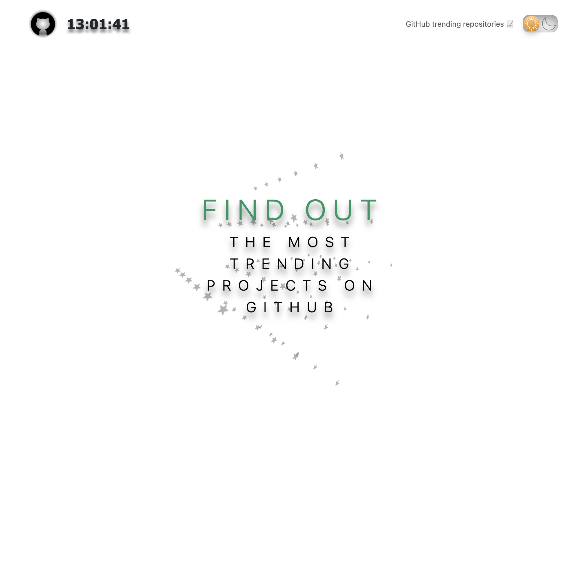
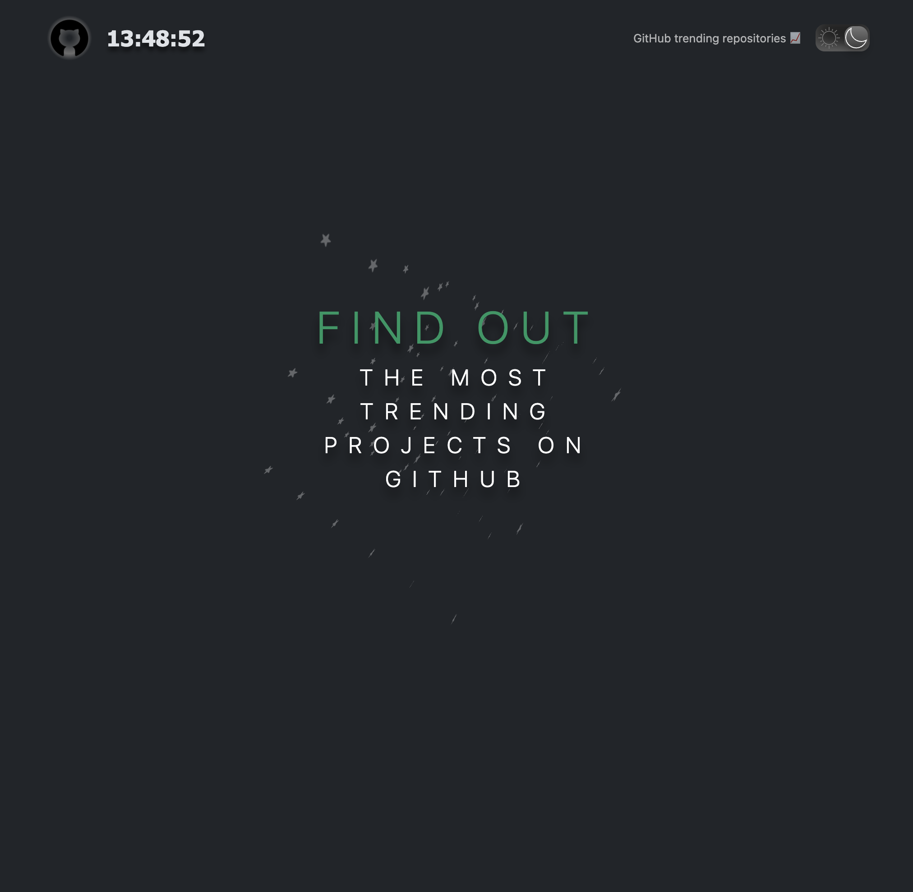
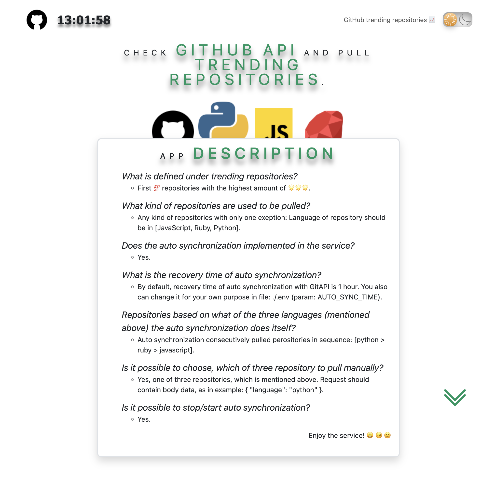
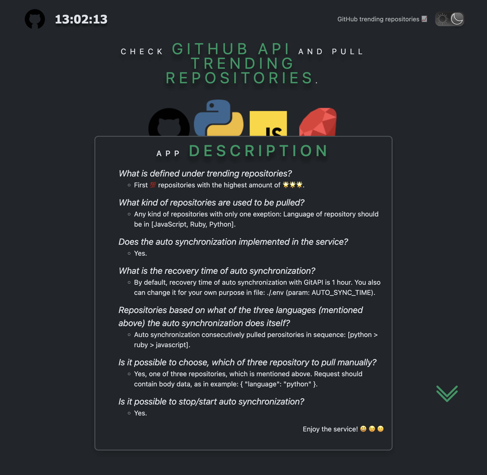
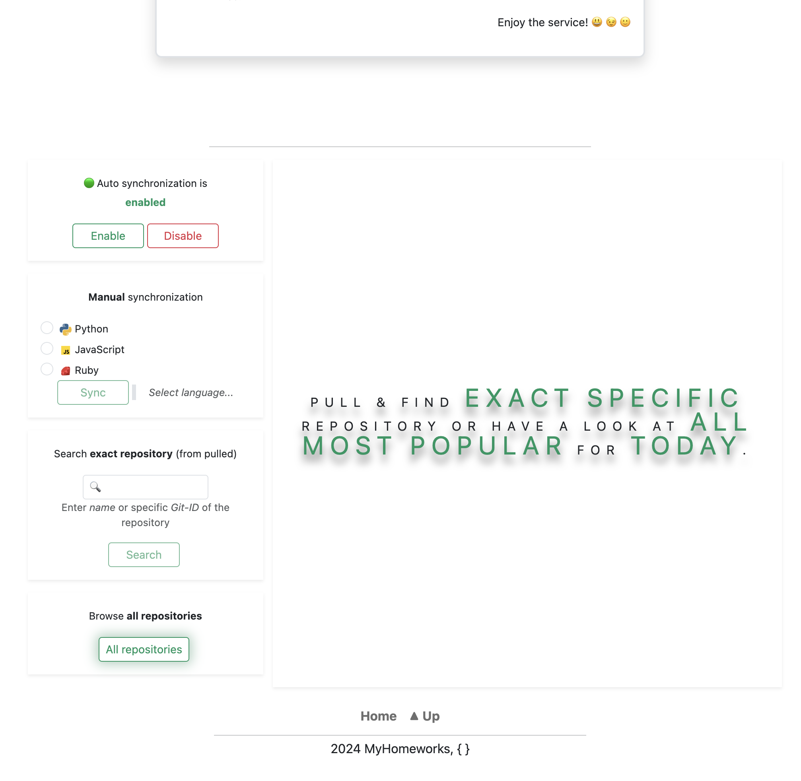
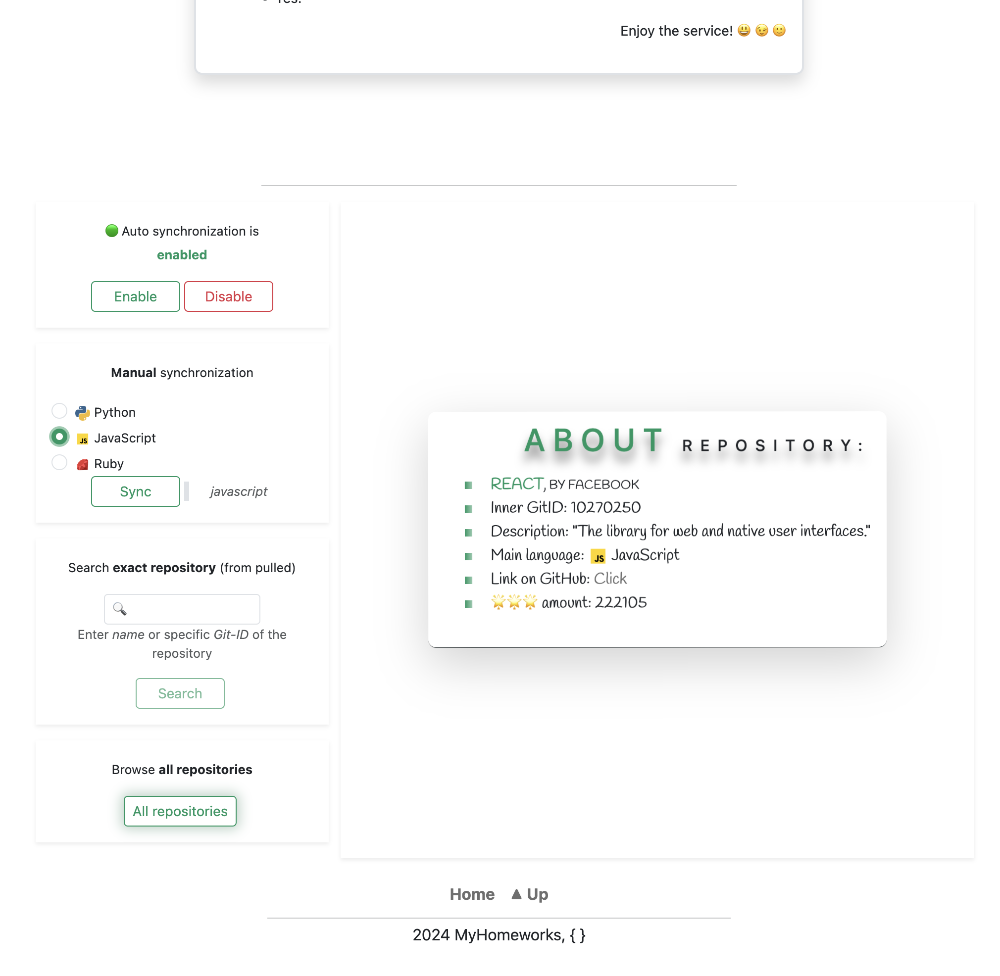
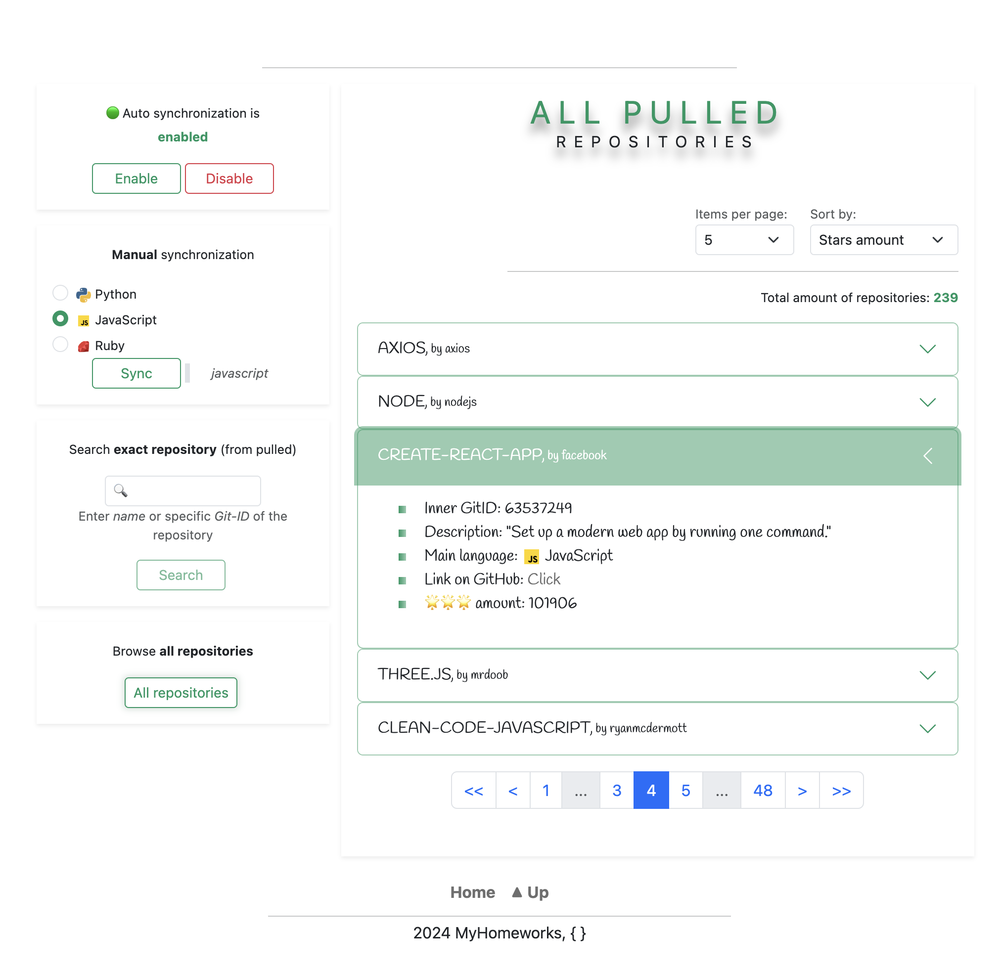
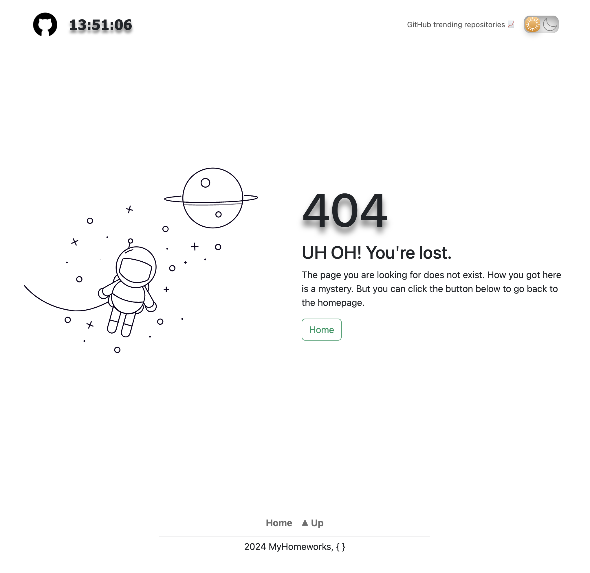

## App Description &#128196;

### <span style="text-align: center;">This is a service, that is able to check GitHub API and pull trending repositories.</span>

<br>

1. What is defined under trending repositories?

    >First &#128175; repositories with the highest amount of &#127775;&#127775;&#127775;.

2. What kind of repositories are used to be pulled?

    >Any kind of repositories with only one exeption: **Language of repository should be: [JavaScript, Ruby, Python].**

3. Does the auto synchronization implemented in the service?

    >Yes.

4. What is the recovery time of auto synchronization?

    >**By default**, recovery time of auto synchronization with GitAPI is **1 hour**. You also can change it for your own purpose in file: ./.env (param: AUTO_SYNC_TIME).

5. Repositories based on what of the three languages (mentioned above) the auto synchronization does itself?

    >Auto synchronization consecutively pulled perositories in sequence: [python > ruby > javascript].

5. Is it possible to choose, which of three repository to pull manually?

    >Yes, one of three repositories, which is mentioned above. <br>*Request should contain body data, as in example:<br> ```
    { "language": "python" }```*.

6. Is it possible to stop/start auto synchronization?

    >Yes.

## Launch instructions &#128196;

Technologies used:

- **Backend**:
  - NodeJS (ExpressJS);
  - MongoDB (mongoose) <span style="font-size: smaller">(cause we have not any relationships in database);</span>
  - Insomnia <span style="font-size: smaller">(for testing API);</span>
  - NGINX;
  - Docker + Compose;
- **Frontend**:
  - Vue3 + Vuex + vue - router;
  - Bootstrap5;
  - Webpack;
  - CSS/SCSS/HTML;

---

1. Clone repository/archive to your **local folder**;
2. Open Terminal and make sure You are in **local folder**:

    ```
    cd '.../local_folder'
    ```

3. Copy file dev.env and rename to .env in the same root directory:

    ```
    cp dev.env .env
    ```

4. *(optional)* Open and follow the instructions in the new created .env file if you want *to specify server-host outer-server-port or outer-db-port for docker containers*;

5. For this step you should already have installed Docker and Compose on your PC. Start installation:

    ```
    docker compose up --build
    ```

- Installation can take some time, it depends on your PC resources;
- After the installation is completed, the app will start automatically on 0.0.0.0:8080;
- Open app using <http://0.0.0.0:8080> in your browser;

6. To stop the app:

    ```
    Ctrl + C
    ```

7. To **stop app** (stop all docker containers):

    ```
    docker compose stop
    ```

8. To **start app** (start all docker containers):

    ```
    docker compose start
    ```

9. To completely **remove** all created docker containers, images and volumes:

   ```
   docker compose down --volumes --rmi all
   ```

## API Endpoints &#128196;

1. **Test URL**:

    <span style="font-size: smaller">request:</span> -> ```http://host:port/```<br>
    -> <span style="font-size: smaller">response (json):</span><br>
        <span align="center">
            
        </span>

2. **Manually synchronization**. Should include body data with language of repositories to synchronization (described in point №5 at "*App description*"):

    <span style="font-size: smaller">request:</span> -> ```http://host:port/api/v1/repos_sync```<br>
    -> <span style="font-size: smaller">response (json):</span><br>
        <span align="center">
            
        </span>

3. **Get all pulled repositories**:

    <span style="font-size: smaller">request:</span> -> ```http://host:port/api/v1/repos_all?sortBy=null&limit=null&page=null```<br>

    Query parametrs should be filled properly:
    - **sortBy**: [ 'stargazers_count', 'name', 'language' ]. Default: 'stargazers_count'
    - **limit**: [ 5, 10, 25 ]. Default: 10
    - **page**: [ page_number ]. Default: 1
    <br>
    -> <span style="font-size: smaller">response (json):</span><br>
        <span align="center">
            
        </span>

4. **Get an exact repository, specified by name or ID** (inner Git ID):

    <span style="font-size: smaller">request:</span> -> ```http://host:port/api/v1/repos_single/:nameOrId```<br>
    -> <span style="font-size: smaller">response (json):</span><br>
        <span align="center">
            
        </span>

5. **Stop server's auto synchronization**:

    <span style="font-size: smaller">request:</span> -> ```http://host:port/api/v1/stop_auto_sync```<br>
    -> <span style="font-size: smaller">response (json):</span><br>
        <span align="center">
            
        </span>
    <br>
    Note: if the auto synchronization is running You will receive a message, that: *Auto sync already enabled!*

6. **Manually start server's auto synchronization**:

    <span style="font-size: smaller">request:</span> -> ```http://host:port/api/v1/start_auto_sync```<br>
    -> <span style="font-size: smaller">response (json):</span><br>
        <span align="center">
            
        </span>
    <br>
    Note: if the auto synchronization is disabled You will receive a message, that: *Auto sync already disabled!*

7. **Server's auto synchronization status**:

    <span style="font-size: smaller">request:</span> -> ```http://host:port/api/v1/status_auto_sync```<br>
    -> <span style="font-size: smaller">response (json):</span><br>
        <span align="center">
            
        </span>
    <br>

### APP Screenshots

1. *Home page (light & dark themes)*

<div align="center">
    
    
</div>

2. *Main page: app description (light & dark themes)*

<div align="center">
    
    
</div>

3. *Main page: data block*

<div align="center">
    
</div>

4. *Main page: get exact repository's data*

<div align="center">
    
</div>

5. *Main page: get all repositories data*

<div align="center">
    
</div>

6. *404 page*

<div align="center">
    
</div>
