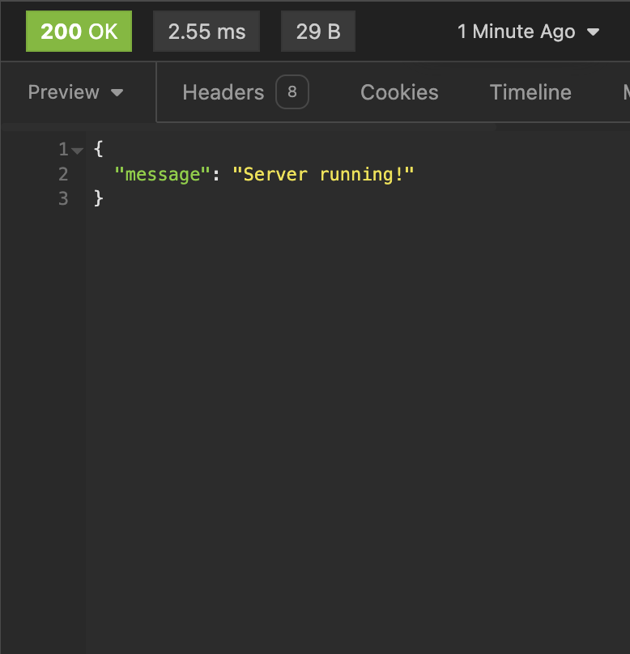
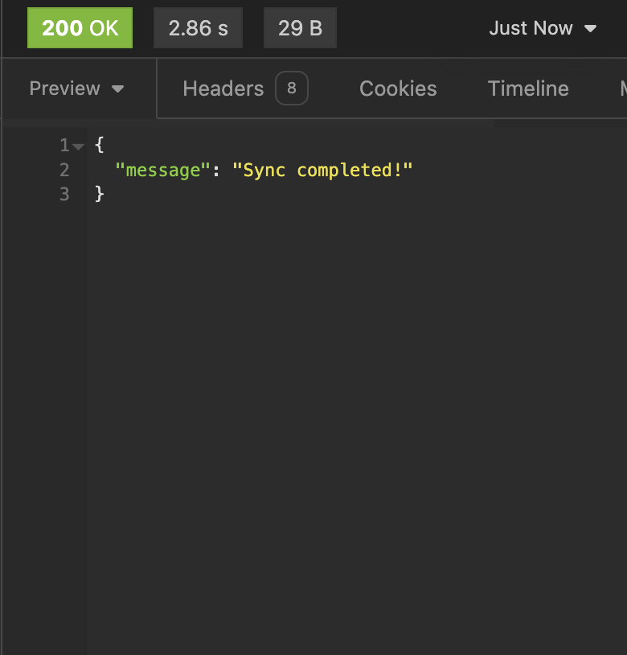
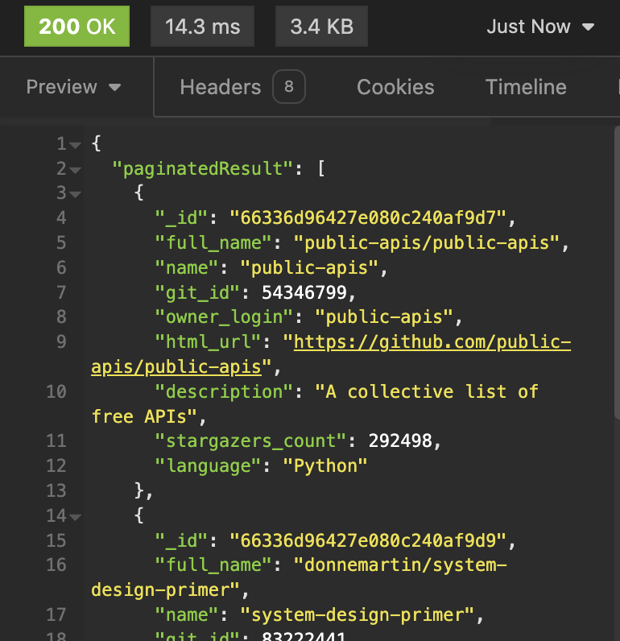
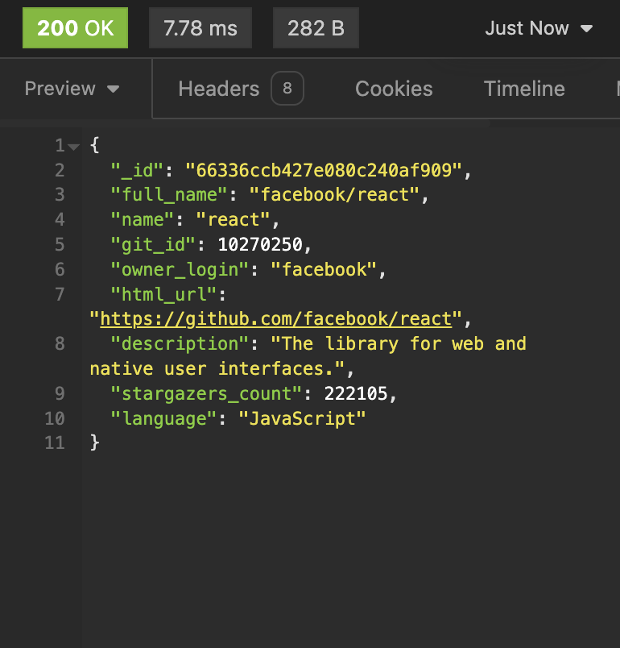
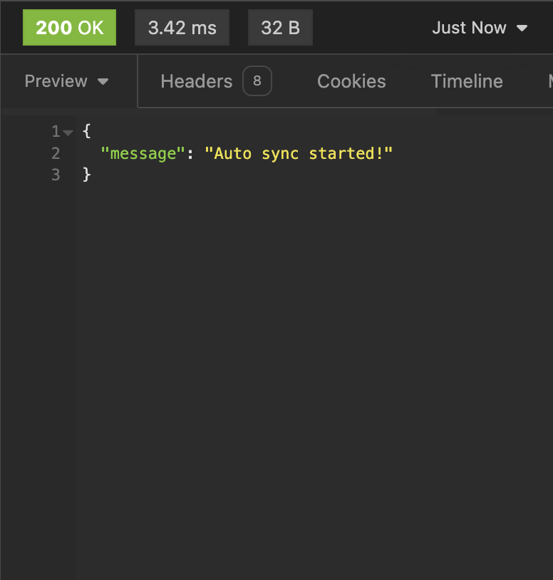

## App Description &#128209;

This service is to check GitHub API and pull basic information about the most trending repositories using NodeJS(ExpressJS), Vue3 and MongoDB.

## About &#128204;

1. What is trending repositories?

    >First &#128175; repositories with the highest &#127775;&#127775;&#127775;

2. What kind of repositories are used to be pulled?

    >Repositories based on **JavaScript, Typescript Ruby or Python**

3. Does the auto synchronization implemented in the service?

    &#9989;

4. What is auto synchronization interval ?

    >**By default** interval of auto synchronization with GitAPI is **1 hour**.
    >
    >Changeable in file: with envs (AUTO_SYNC_TIME).

5. Is it possible to manually pull repositories of chosen language?

    &#9989;

6. Is it possible to stop/start auto synchronization?

    &#9989;

## Launch instructions &#128190;

&#9881; **Frontend**:

- Vue3;
- Vuex;
- Bootstrap5;
- Webpack;
  
&#9881; **Backend**:

- ExpressJS;
- MongoDB;
- Mongoose;
- Docker;
- NGINX;
- Jest;
- Swagger;

<div style="display: flex; justify-content: end;">
  <p>Git and Docker should be installed locally on Your PC.</p>
</div>

---

1. Clone repository to Your local path:

  ```sh
  cd <your_local_path> && git clone <http/ssh-link>
  ```

2. Run compose:

  ```sh
  cd GitHubTrending && docker compose  --env-file ./.env.public -f ./compose.yaml up --build   
  ```

3. After the installation is complete the web-app will start on `http://localhost:<NGINX_WEBSERVER_PORT>`;

4. Stop the web-app press in current terminal:

  ```sh
  Ctrl + C
  # or
  docker compose --env-file ./.env.public stop
  ```

5. Start again the web-app:

  ```sh
  docker compose --env-file ./.env.public start
  ```

6. To completely remove all related docker containers, docker images, volumes and related data:

  ```sh
  docker compose --env-file ./.env.public down --volumes --rmi all
  ```

  <span style="color: rgb(255, 0, 0)">After this step, it is need to go back to point №2 to run web-app again.</span>


<!-- ## API Endpoints &#128196;

1. **Test URL**:

    <span style="font-size: smaller">request:</span> -> ```http://host:port/```<br>
    -> <span style="font-size: smaller">response (json):</span><br>
        <span align="center">
            
        </span>

2. **Manually synchronization**. Should include body data with language of repositories to synchronization (described in point №5 at "*App description*"):

    <span style="font-size: smaller">request:</span> -> ```http://host:port/api/v1/repos_sync```<br>
    -> <span style="font-size: smaller">response (json):</span><br>
        <span align="center">
            
        </span>

3. **Get all pulled repositories**:

    <span style="font-size: smaller">request:</span> -> ```http://host:port/api/v1/repos_all?sortBy=null&limit=null&page=null```<br>

    Query parametrs should be filled properly:
    - **sortBy**: [ 'stargazers_count', 'name', 'language' ]. Default: 'stargazers_count'
    - **limit**: [ 5, 10, 25 ]. Default: 10
    - **page**: [ page_number ]. Default: 1
    <br>
    -> <span style="font-size: smaller">response (json):</span><br>
        <span align="center">
            
        </span>

4. **Get an exact repository, specified by name or ID** (inner Git ID):

    <span style="font-size: smaller">request:</span> -> ```http://host:port/api/v1/repos_single/:nameOrId```<br>
    -> <span style="font-size: smaller">response (json):</span><br>
        <span align="center">
            
        </span>

5. **Stop server's auto synchronization**:

    <span style="font-size: smaller">request:</span> -> ```http://host:port/api/v1/stop_auto_sync```<br>
    -> <span style="font-size: smaller">response (json):</span><br>
        <span align="center">
            
        </span>
    <br>
    Note: if the auto synchronization is running You will receive a message, that: *Auto sync already enabled!*

6. **Manually start server's auto synchronization**:

    <span style="font-size: smaller">request:</span> -> ```http://host:port/api/v1/start_auto_sync```<br>
    -> <span style="font-size: smaller">response (json):</span><br>
        <span align="center">
            
        </span>
    <br>
    Note: if the auto synchronization is disabled You will receive a message, that: *Auto sync already disabled!*

7. **Server's auto synchronization status**:

    <span style="font-size: smaller">request:</span> -> ```http://host:port/api/v1/status_auto_sync```<br>
    -> <span style="font-size: smaller">response (json):</span><br>
        <span align="center">
            
        </span>
    <br> -->

---

### p.s

- Local environment variables can be changed in the `./.env.public`<br/>

## API routes &#128190;

API documentation <b>(Swagger OpenAPIv3)</b> is automatically generated by the <b>swagger-autogen</b> module and available on `http://.../api/v1/docs/` when app has been started.

Also available in `json` on path: `server/docs/swagger-output.json`.

## Screenshots &#127745;

1. Home page (light & dark themes)

<div align="center">
    
    
</div>

2. Main page: app description

<div align="center">
    
</div>

3. Main page: data block

<div align="center">
    
</div>

4. Main page: get exact repository's data

<div align="center">
    
</div>

5. Main page: get all repositories data

<div align="center">
    
</div>

6. 404 page

<div align="center">
    
</div>
